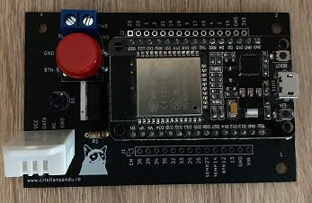
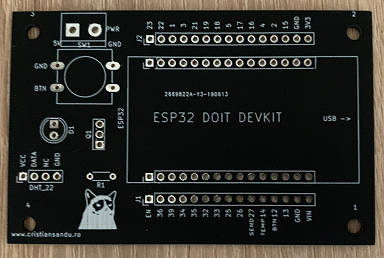

# ESP32 Home Sensor: AC Control #

## General info ##
This is a small board to add Home Assistant control to your old school AC.  
It uses an ESP32 for WiFi connectivity and IR code sending(via the RMT peripheral).  

This is what it looks like when fully built:  

And this is the bare PCB:  

## Building ##
For a Fritzing breadboard schematic see [this Fritzing file](schematic/schematic.fzz).  
For the PCB I used the ESP32 30-pin DoIT devkit board footprint from this [repo](https://github.com/RuiSantosdotme/ESP32-Weather-Shield-PCB).  

The KiCad sources for the PCB are in [this folder](pcb/esp32-ac-board).  

### BOM ###
  
There very few parts you will need:  

- An ESP32 Doit Devkit v1 (the 30 pin version see [this](https://randomnerdtutorials.com/getting-started-with-esp32/))  
- A NPN trransistor in TO220 package(you could change the design to use a TO92 transistor) like the [2N5296](https://www.mouser.com/ds/2/68/2n5294-46674.pdf)  
- Some male and female pin headers(pitch 2.54'')
- A 12x12mm button  
- An IR LED
- A DHT22 humidity and temperature sensor  

### The Code ###

The code uses the [Platformio](https://platformio.org/) ecosystem so you will need that to build it(sorry, no Arduino IDE support).  
Currently it relies on the [esphome-core](https://github.com/esphome/esphome-core) library to connect to Home Assistant but I will need to get rid of it and use just MQTT messages because the author is no longer supporting the C++ API.  

### AC Control ###

To control your AC you will need to change the RAW codes in the [config.h](src/config.h) file. I used [AnalysIR](https://www.analysir.com/) to get my raw codes but you could also get them with an Arduinoor even Lirc with irrecord(it's what I initially did). Hardware wise you will either need an Arduino/Raspberry Pi + TSOP4838 receiver(or any other receiver) or maybe an all-in-one solution like the [USB IR Toy](http://dangerousprototypes.com/docs/USB_Infrared_Toy) - which I already had and used.
